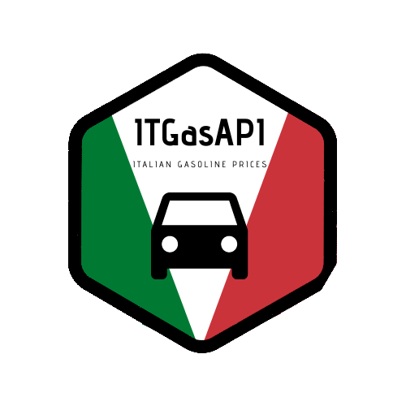
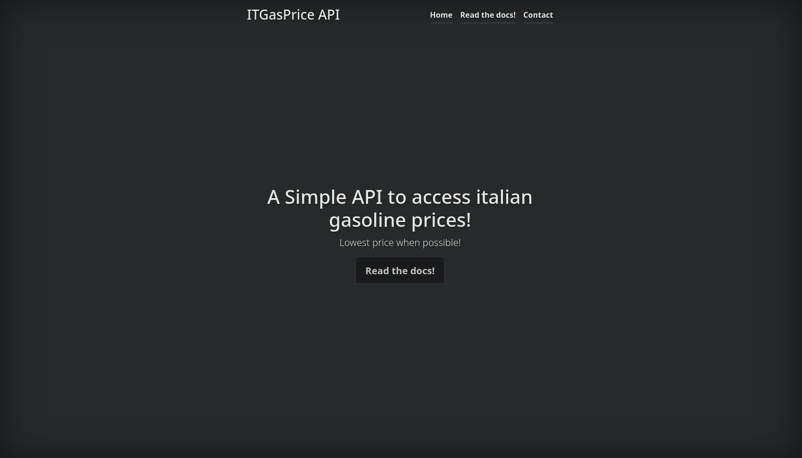
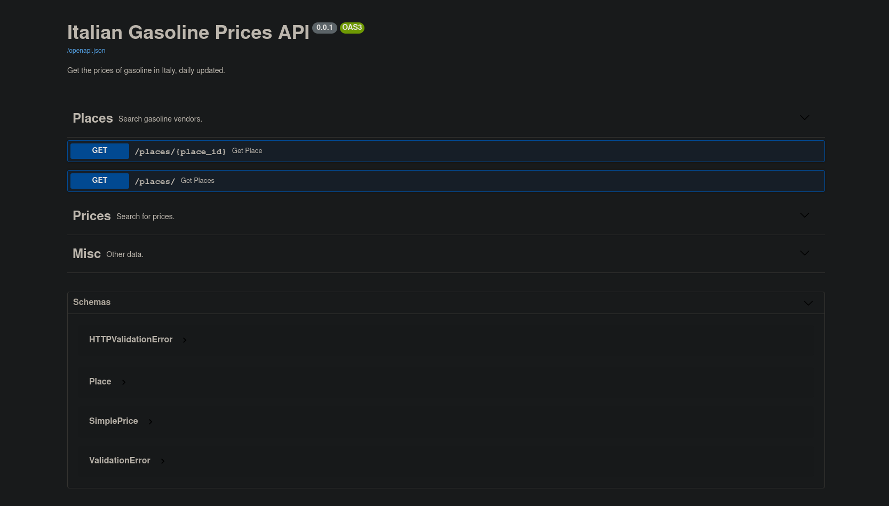
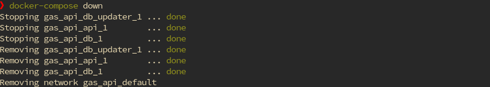

<div align="center">
    
</div>

<h1 align="center">Italian Gasoline Prices API</h1>

<div align="center">

  []() 
  [](https://github.com/Kastakin/Italian-Gasoline-Prices-API/issues)
  [](https://github.com/Kastakin/Italian-Gasoline-Prices-API/pulls)
  [](/LICENSE)

</div>

---

<p align="center"> Few lines describing your project.
    <br> 
</p>

## Table of Contents

- [Table of Contents](#table-of-contents)
- [About](#about)
- [Getting Started](#getting-started)
  - [Prerequisites](#prerequisites)
  - [Installing](#installing)
- [Usage](#usage)
- [Contributing](#contributing)
- [Built Using](#built-using)
- [Authors](#authors)

## About

The Italian Government makes aviable to every citzen the price charged by gas stations for gasoline along with their location on the territory. This information is free of charge but not really presented in an accessible way.

This little stack fetches these prices from the [government website](https://www.sviluppoeconomico.gov.it/index.php/it/open-data/elenco-dataset/2032336-carburanti-prezzi-praticati-e-anagrafica-degli-impianti), stores the data in a PostgreSQL DB and makes it accessible from an API powered by [FastAPI](https://fastapi.tiangolo.com/).

The project is still in an early stage of developemnt and at the momemnt is more a proof of concept then a finished product!

Suggestions, bugs and modifications are welcome! Check the [Contributing section](#contributing) if you want to get involved!

## Getting Started

These instructions will guide you through the steps needed to setup a local development envoirment.

### Prerequisites

Install [Git](https://git-scm.com/book/en/v2/Getting-Started-Installing-Git), [Docker](https://docs.docker.com/get-docker/) and [Docker-Compose](https://docs.docker.com/compose/install/).

### Installing

Clone the repository on your system:

```[bash]
git clone https://github.com/Kastakin/Italian-Gasoline-Prices-API.git
```

From the terminal move inside the downloaded folder and run:

```[bash]
docker-compose up -d
```

You should get an output similar to the following indicating that the three services were started correctly:


## Usage

The stack is built with 3 containers:

- PostgreSQL container that holds the gas stations coordinates and prices in a DB.
- Python container with a python app that automatically updates the DB every day.
- Python container running an Uvicorn ASGI server to serve the API.

The API serves an homepage/landing page at `https://localhost:8000/`



The interactive Docs created by the FastAPI framework are aviable at `https://localhost:8000/docs`



To shutdown the stack open the terminal and navigate to the folder containing the cloned repository and issue the command:

```[bash]
docker-compose down
```

This will stop and remove the containers used in the stack:



## Contributing

Contributions are more then welcome, no matter what your level of experience might be!

Check the [Contributing Guidilines](/CONTRIBUTING.md) for the project!

## Built Using

- [Docker](https://www.docker.com/) - Containerization
- [FastAPI](https://fastapi.tiangolo.com/) - API Framework
- [Pandas](https://pandas.pydata.org/) - .csv parsing and data manipulation
- [SQLAlchemy](https://www.sqlalchemy.org/) - SQL management
- [PostgreSQL](https://www.postgresql.org/) - Database
- [Schedule](https://pypi.org/project/schedule/) - Automatic DB update

## Authors

- [@Kastakin](https://github.com/kastakin) - Idea & Initial work

See also the list of [contributors](https://github.com/Kastakin/Italian-Gasoline-Prices-API/graphs/contributors) who participated in this project.
